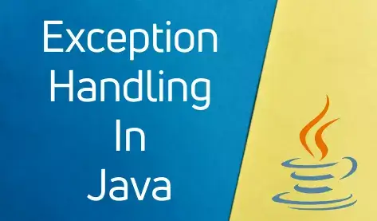

  

<h2>Назначение проекта</h2>

 Напишите приложение, которое будет запрашивать у пользователя следующие данные в произвольном порядке, разделенные пробелом:
      Фамилия Имя Отчество дата_рождения номер_телефона пол

<h5>Продвинутая работа с исключениями в Java</h3>
<body>
   <dev>
   
Сервис позволяет:

     <ul>
     <li>Приложение должно проверить введенные данные по количеству. 
         Если количество не совпадает с требуемым, вернуть код ошибки, обработать его и показать пользователю сообщение, 
         что он ввел меньше и больше данных, чем требуется.;
    </li>
     <li>Приложение должно попытаться распарсить полученные значения и выделить из них требуемые параметры. 
         Если форматы данных не совпадают, нужно бросить исключение, соответствующее типу проблемы.;</li>
     <li>Можно использовать встроенные типы java и создать свои. Исключение должно быть корректно обработано, 
         пользователю выведено сообщение с информацией, что именно неверно;</li>
     <li>Если всё введено и обработано верно, должен создаться файл с названием, равным фамилии, в него в одну строку должны записаться полученные данные, вида
         Фамилия Имя Отчество дата_рождения номер_телефона пол</li>
     <li>Однофамильцы должны записаться в один и тот же файл, в отдельные строки;</li>
     <li>Не забудьте закрыть соединение с файлом;</li>   
     <li>При возникновении проблемы с чтением-записью в файл, исключение должно быть корректно обработано, 
         пользователь должен увидеть стектрейс ошибки.;</li>   
    </ul>
   

     </dev>

     <h2>Технические требования:</h2>

<ul>
     <li>Java версии не ниже 8;</li>
</ul>